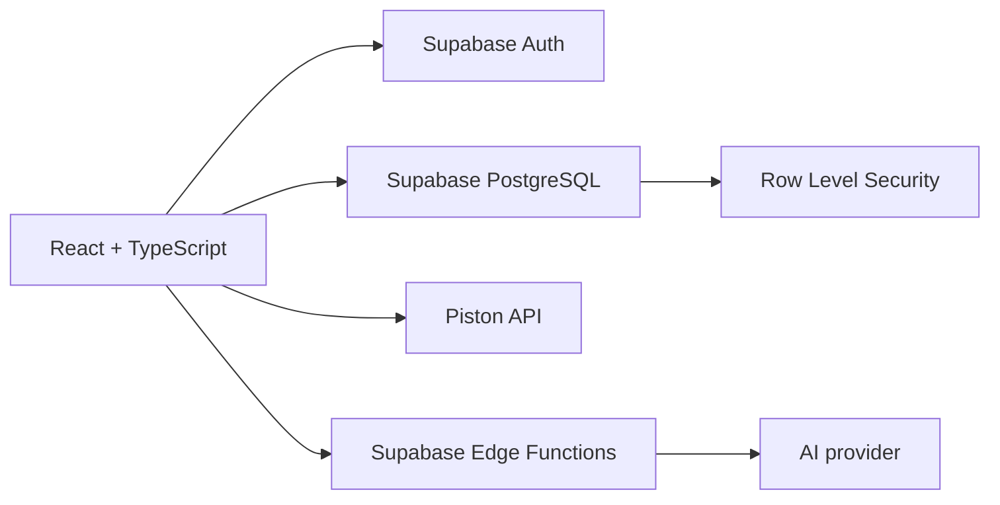

# Sarpedon

<div align="center">


**An open-source platform for browser-based programming education, automated
assessment, and classroom management.**

**English** | [Русский](README.ru.md)

[](https://www.typescriptlang.org/)
[](https://react.dev/)
[](https://vite.dev/)
[](https://supabase.com/)
[](LICENSE)

</div>

## Overview

Sarpedon helps students learn programming in the browser while giving teachers
the tools needed to manage classes, create exercises, monitor lessons, and
review progress. It combines a React application with Supabase authentication,
PostgreSQL, Row Level Security, external code execution, and optional
AI-assisted feedback.

The interface and learning content currently focus on Russian-speaking
classrooms, while the project documentation and source code are open to an
international contributor community.

## Features

### Students

- Solve programming exercises in a Monaco-based editor.
- Run code and receive automated test-case feedback.
- Track progress, submissions, skills, and learning history.
- Receive optional AI-generated explanations and progressive hints.
- Participate in classroom and competition workflows.

### Teachers

- Manage students, classes, credentials, and bulk imports.
- Create and edit exercises, test cases, and entrance assessments.
- Monitor active lessons and review student activity.
- Explore class, student, level, and proficiency analytics.
- Use AI-assisted exercise generation and feedback tools.

### Classroom displays and editors

- Dedicated read-only classroom display dashboards.
- Student-editor workflow for proposing learning content.
- Role-based routes for students, teachers, editors, and displays.

## Architecture



Core technologies:

- React 18, TypeScript, Vite, React Router, and Tailwind CSS
- Supabase Auth, PostgreSQL, Realtime, Edge Functions, and RLS
- Monaco Editor for browser-based coding
- Piston API for code execution
- Vitest and Testing Library for automated tests

## Getting Started

### Prerequisites

- Node.js 18 or newer
- npm 9 or newer
- A Supabase project

### Installation

```bash
git clone https://github.com/chas36/sarpedon.git
cd sarpedon
npm install
cp .env.example .env
```

Configure the public Supabase values in `.env`:

```env
VITE_SUPABASE_URL=your_supabase_project_url
VITE_SUPABASE_ANON_KEY=your_supabase_anon_key
VITE_APP_URL=http://localhost:5173
```

Apply the SQL migrations from [`supabase/migrations`](supabase/migrations) to
your Supabase project, then start the development server:

```bash
npm run dev
```

The application is available at `http://localhost:5173`.

## AI Configuration

AI features are implemented through Supabase Edge Functions. Provider API keys
must be configured as Edge Function secrets and must never be exposed through
`VITE_*` variables or committed to the repository.

For the current Groq integration:

```bash
supabase secrets set GROQ_API_KEY=your_key
```

See the deployment notes in [`docs`](docs) and
[`supabase/README.md`](supabase/README.md) for feature-specific setup.

## Development

```bash
npm run dev
npm test -- --run
npm run lint
npm run build:strict
```

The repository includes tests for authentication, role guards, learning flows,
teacher APIs and utilities, code execution, layouts, and shared UI components.

## Security

Sarpedon processes student data and submits untrusted learner code to an
external execution service. Deployments should:

- review every Supabase RLS policy before handling real student data;
- keep service-role and AI provider keys exclusively on the server;
- configure allowed origins for Edge Functions;
- avoid logging credentials, tokens, student code, or personal data;
- keep dependencies and the external execution service up to date.

Please report security issues privately to the maintainer rather than opening a
public issue with exploit details.

## Project Status

Sarpedon is under active development. Core learning, classroom administration,
lesson monitoring, analytics, content editing, and display workflows are
implemented. Some features, including parts of entrance testing, character
graphics, and advanced gamification, remain experimental or disabled.

The project does not yet guarantee backward-compatible database migrations or
production stability. Review migrations and security policies before deploying
it in a real classroom.

## Contributing

Contributions are welcome:

1. Fork the repository.
2. Create a focused feature branch.
3. Add or update tests for behavioral changes.
4. Run the test, lint, and strict build commands.
5. Open a pull request describing the motivation and impact.

Use Conventional Commits where practical. Keep secrets, generated build output,
and local environment files out of commits.

## License

Sarpedon is available under the [MIT License](LICENSE).

## Maintainer

Maintained by [@chas36](https://github.com/chas36).
