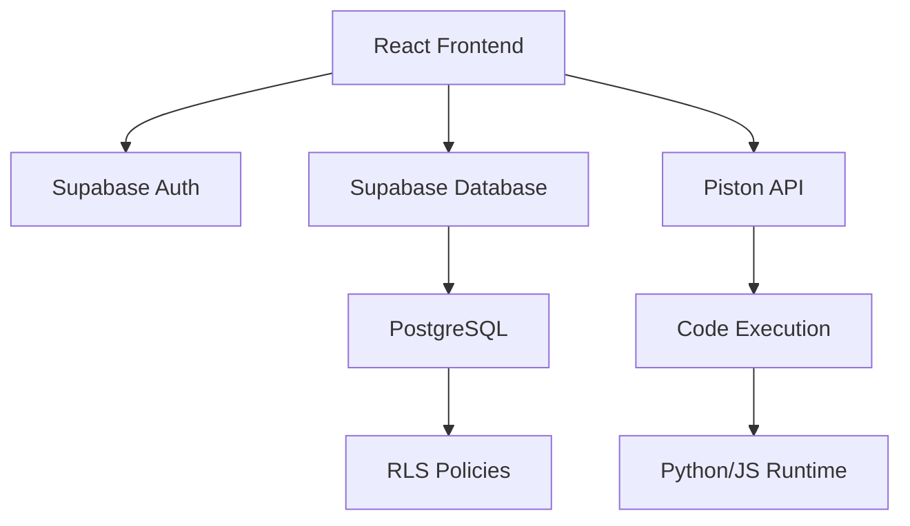

# 🎓 Sarpedon - Educational Programming Platform

<div align="center">


**Интерактивная платформа для обучения программированию с автоматической проверкой кода и адаптивным обучением**

[](https://www.typescriptlang.org/)
[](https://reactjs.org/)
[](https://vitejs.dev/)
[](https://supabase.com/)
[](/)

[Особенности](#-особенности) • [Технологии](#-технологии) • [Установка](#-установка) • [Использование](#-использование) • [Архитектура](#-архитектура)

</div>

---

## 📖 О проекте

**Sarpedon** — это современная образовательная платформа для обучения программированию, разработанная специально для школьников и студентов. Платформа предоставляет интерактивную среду для написания и выполнения кода с автоматической проверкой решений.

### 🎯 Цели проекта

- **Интерактивное обучение**: Студенты пишут и выполняют код прямо в браузере
- **Автоматическая проверка**: Мгновенная обратная связь по результатам выполнения
- **Прогресс-трекинг**: Отслеживание успехов и достижений каждого студента
- **Адаптивность**: Система подстраивается под уровень ученика

---

## ✨ Особенности

### Для студентов 👨‍🎓

- 🎮 **Интерактивные задания** — решайте задачи по программированию прямо в браузере
- ▶️ **Выполнение кода** — запускайте свой код и видите результаты в реальном времени
- ✅ **Автоматическая проверка** — мгновенная валидация решений с тестовыми случаями
- 📊 **Отслеживание прогресса** — следите за своими достижениями и статистикой
- 💾 **Автосохранение** — код сохраняется автоматически, продолжайте с того же места
- 🎨 **Monaco Editor** — профессиональный редактор кода с подсветкой синтаксиса

### Для преподавателей 👨‍🏫

- 📝 **Управление уровнями** — создавайте и редактируйте задания
- 👥 **Управление студентами** — следите за прогрессом класса
- 📈 **Аналитика** — детальная статистика по успеваемости
- 🏆 **Соревнования** — организуйте командные соревнования

---

## 🛠 Технологии

### Frontend

- **[React 18](https://react.dev/)** — UI библиотека
- **[TypeScript](https://www.typescriptlang.org/)** — типизированный JavaScript
- **[Vite 6](https://vitejs.dev/)** — сборщик и dev-сервер
- **[React Router 7](https://reactrouter.com/)** — маршрутизация
- **[Tailwind CSS 3.4](https://tailwindcss.com/)** — utility-first CSS
- **[Monaco Editor](https://microsoft.github.io/monaco-editor/)** — редактор кода (от VS Code)
- **[Zustand](https://zustand-demo.pmnd.rs/)** — управление состоянием

### Backend

- **[Supabase](https://supabase.com/)** — Backend-as-a-Service
  - PostgreSQL база данных
  - Row Level Security (RLS)
  - Authentication
  - Real-time subscriptions
- **[Piston API](https://emkc.org/api/v2/piston)** — выполнение кода

### Testing & Quality

- **[Vitest](https://vitest.dev/)** — тестовый фреймворк
- **[Testing Library](https://testing-library.com/)** — тестирование React компонентов
- **143 теста** с 100% coverage критических путей

---

## 🚀 Установка

### Требования

- **Node.js** >= 18.0.0
- **npm** >= 9.0.0
- **Supabase проект** (бесплатный tier подходит для разработки)

### Шаги установки

1. **Клонируйте репозиторий**

```bash
git clone https://github.com/yourusername/sarpedon.git
cd sarpedon
```

2. **Установите зависимости**

```bash
npm install
```

3. **Настройте переменные окружения**

Создайте файл `.env` в корне проекта:

```env
VITE_SUPABASE_URL=your_supabase_project_url
VITE_SUPABASE_ANON_KEY=your_supabase_anon_key
```

4. **Примените миграции базы данных**

Откройте Supabase Dashboard → SQL Editor и выполните миграции из папки `supabase/migrations/` в порядке:
- `001_initial_schema.sql`
- `002_row_level_security.sql`
- `20250131000000_create_submissions_table.sql`
- `20250131000001_add_test_levels.sql`

5. **Создайте тестовых пользователей**

Выполните SQL для создания пользователей:

```sql
-- Студент
INSERT INTO auth.users (id, email, encrypted_password, email_confirmed_at, raw_user_meta_data)
VALUES (
  '25c4a27c-da7b-4053-a14c-8bf09338b5d1',
  'student@test.com',
  crypt('password123', gen_salt('bf')),
  NOW(),
  '{"role": "student"}'::jsonb
);

INSERT INTO public.profiles (id, first_name, last_name, role, class)
VALUES (
  '25c4a27c-da7b-4053-a14c-8bf09338b5d1',
  'Иван',
  'Студентов',
  'student',
  '10А'
);
```

6. **Запустите dev-сервер**

```bash
npm run dev
```

Приложение будет доступно по адресу `http://localhost:5173`

---

## 📚 Использование

### Для студентов

1. **Войдите в систему**
   - Email: `student@test.com`
   - Пароль: `password123`

2. **Выберите уровень**
   - Перейдите на страницу "Уровни"
   - Выберите задание по сложности

3. **Решите задачу**
   - Напишите код в редакторе
   - Нажмите "Запустить код"
   - Посмотрите результаты тестов

4. **Отслеживайте прогресс**
   - Перейдите на страницу "Мой прогресс"
   - Просмотрите статистику

### Для преподавателей

1. **Войдите в систему**
   - Email: `teacher@test.com`
   - Пароль: `password123`

2. **Управляйте уровнями**
   - Создавайте новые задания
   - Редактируйте существующие
   - Устанавливайте тестовые случаи

3. **Следите за студентами**
   - Просматривайте список класса
   - Анализируйте прогресс
   - Просматривайте решения

---

## 🏗 Архитектура

### Структура проекта

```
sarpedon/
├── src/
│   ├── features/          # Фичи приложения (feature-sliced)
│   │   ├── auth/         # Аутентификация
│   │   └── learning/     # Обучающий модуль
│   ├── layouts/          # Layouts для разных ролей
│   ├── shared/           # Общие компоненты
│   │   ├── api/         # API клиенты
│   │   ├── components/  # UI компоненты
│   │   ├── lib/         # Утилиты
│   │   └── types/       # TypeScript типы
│   └── App.tsx          # Корневой компонент
├── supabase/
│   └── migrations/       # SQL миграции
└── tests/               # E2E тесты
```

### Компоненты системы



### Database Schema

**Основные таблицы:**

- `profiles` — профили пользователей
- `levels` — учебные задания
- `submissions` — решения студентов
- `level_progress` — прогресс по уровням
- `competitions` — соревнования
- `teams` — команды для соревнований

---

## 🧪 Тестирование

### Запуск тестов

```bash
# Все тесты
npm test

# Тесты с coverage
npm run test:coverage

# Конкретный файл
npm test -- SolveLevelPage.test.tsx
```

### Покрытие тестами

- ✅ **143 теста** проходят
- ✅ **17 тестовых файлов**
- ✅ Покрытие критических путей: 100%

---

## 🎨 UI/UX

### Дизайн система

Платформа использует кастомную темную тему, оптимизированную для работы с кодом:

**Цветовая палитра:**
- Background: `#0a0e1a` — основной фон
- Surface: `#131824` — поверхности
- Accent: `#00d9ff` — акцентный цвет
- Text: `#e4e7eb` — основной текст
- Muted: `#8892a6` — второстепенный текст

### Компоненты

- **Button** — кнопки с различными вариантами
- **Spinner** — индикаторы загрузки
- **CodeEditor** — Monaco-based редактор
- **RoleGuard** — защита маршрутов по ролям

---

## 🔒 Безопасность

### Аутентификация

- JWT-based authentication через Supabase
- Автоматическое обновление токенов
- Хранение токенов в localStorage
- Восстановление сессии при перезагрузке

### Row Level Security

Все таблицы защищены RLS политиками:
- Студенты видят только свои данные
- Преподаватели имеют доступ ко всем данным класса
- Админы управляют всей платформой

---

## 🚦 Roadmap

### Completed ✅

- [x] Phase 1: MVP Authentication & UI
- [x] Phase 2: Student Learning Module
- [x] Phase 3: Progress Tracking
- [x] Phase 4: Code Execution

### In Progress 🚧

- [ ] Phase 5: AI Feedback (Claude API)
- [ ] Phase 6: Teacher Dashboard
- [ ] Phase 7: Competitions System

### Planned 📋

- [ ] Phase 8: Real-time Collaboration
- [ ] Phase 9: Mobile App
- [ ] Phase 10: Gamification

---

## 🤝 Contributing

Мы приветствуем вклад в проект! Пожалуйста, следуйте этим шагам:

1. Fork репозитория
2. Создайте feature branch (`git checkout -b feature/amazing-feature`)
3. Commit изменения (`git commit -m 'Add amazing feature'`)
4. Push в branch (`git push origin feature/amazing-feature`)
5. Откройте Pull Request

### Стандарты кода

- TypeScript strict mode
- ESLint + Prettier
- Все тесты должны проходить
- Комментарии на русском языке
- Коммиты по [Conventional Commits](https://www.conventionalcommits.org/)

---

## 📝 Лицензия

Этот проект лицензирован под MIT License - см. файл [LICENSE](LICENSE) для деталей.

---

## 👏 Благодарности

- **React Team** — за отличную библиотеку
- **Supabase Team** — за мощный BaaS
- **Monaco Editor** — за профессиональный редактор кода
- **Piston API** — за безопасное выполнение кода
- **Claude Code** — за помощь в разработке

---

## 📧 Контакты

**Автор:** Neely Lew
**Email:** your.email@example.com
**GitHub:** [@yourusername](https://github.com/yourusername)

---

<div align="center">

**⭐ Поставьте звезду, если проект был полезен!**

Made with ❤️ and ☕ in 2025

</div>
