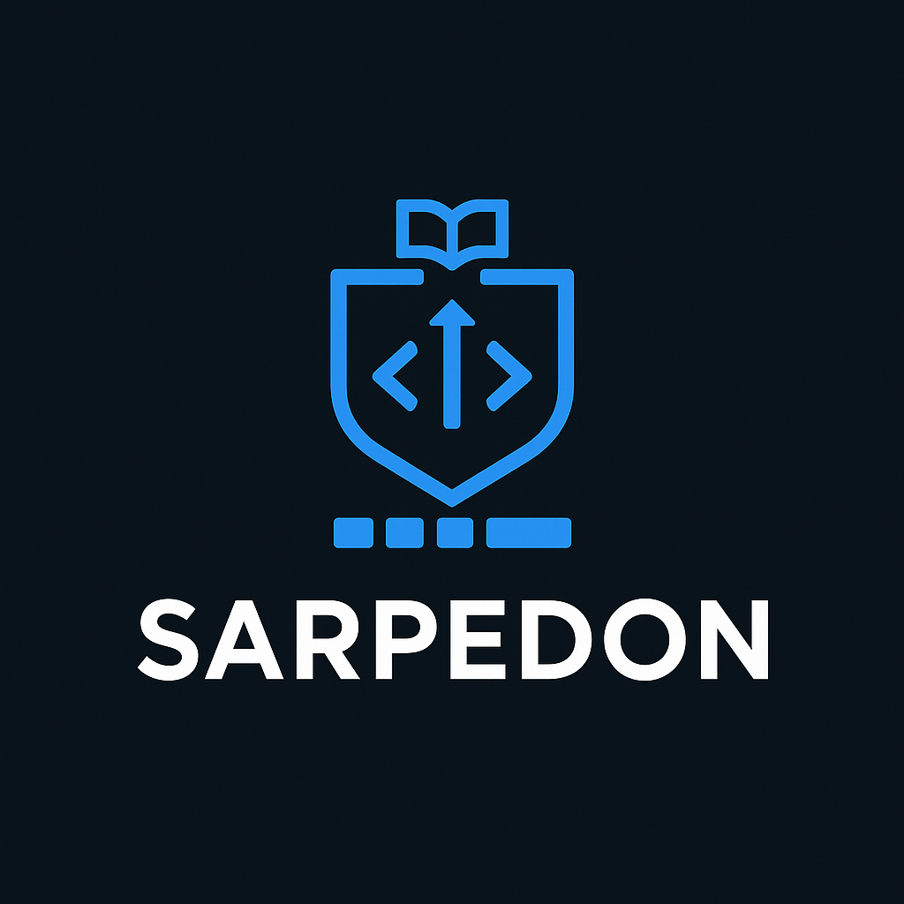
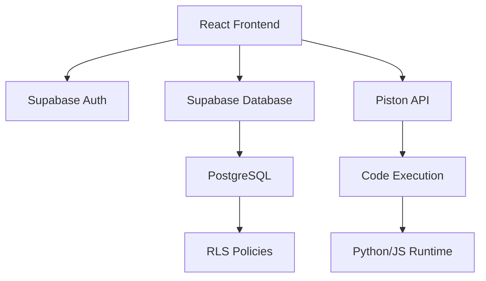

# 🎓 Sarpedon - Educational Programming Platform

<div align="center">



**Интерактивная платформа для обучения программированию с автоматической проверкой кода и адаптивным обучением**

[](https://www.typescriptlang.org/)
[](https://reactjs.org/)
[](https://vitejs.dev/)
[](https://supabase.com/)
[](/)

[Особенности](#-особенности) • [Технологии](#-технологии) • [Установка](#-установка) • [Использование](#-использование) • [Архитектура](#-архитектура)

</div>

---

## 📖 О проекте

**Sarpedon** — это современная образовательная платформа для обучения программированию, разработанная специально для школьников и студентов. Платформа предоставляет интерактивную среду для написания и выполнения кода с автоматической проверкой решений.

### 🎯 Цели проекта

- **Интерактивное обучение**: Студенты пишут и выполняют код прямо в браузере
- **Автоматическая проверка**: Мгновенная обратная связь по результатам выполнения
- **Прогресс-трекинг**: Отслеживание успехов и достижений каждого студента
- **Адаптивность**: Система подстраивается под уровень ученика

---

## ✨ Особенности

### Для студентов 👨‍🎓

- 🎮 **Интерактивные задания** — решайте задачи по программированию прямо в браузере
- ▶️ **Выполнение кода** — запускайте свой код и видите результаты в реальном времени
- ✅ **Автоматическая проверка** — мгновенная валидация решений с тестовыми случаями
- 🤖 **AI Наставник** — умные персонализированные подсказки от Llama 3.1 (Groq API, бесплатно!)
- 🐻 **Система персонажей** — интерактивные персонажи-медведи с уникальными характерами (в разработке)
- 📊 **Отслеживание прогресса** — следите за своими достижениями и статистикой
- 💾 **Автосохранение** — код сохраняется автоматически, продолжайте с того же места
- 🎨 **Monaco Editor** — профессиональный редактор кода с подсветкой синтаксиса

### Для преподавателей 👨‍🏫

- 📝 **Управление уровнями** — создавайте и редактируйте задания
- 👥 **Управление студентами** — добавляйте, редактируйте, удаляйте учеников
- 📊 **Массовый импорт** — добавление учеников списком (с авто-генерацией логинов)
- 🔐 **Управление учетными данными** — генерация логинов, сброс паролей, копирование данных
- 🏫 **Управление классами** — создавайте и организуйте классы
- 📈 **Детальная статистика** — просматривайте прогресс каждого ученика
- 💾 **Экспорт данных** — скачивайте учетные данные в CSV
- 🏆 **Соревнования** — организуйте командные соревнования

---

## 🛠 Технологии

### Frontend

- **[React 18](https://react.dev/)** — UI библиотека
- **[TypeScript](https://www.typescriptlang.org/)** — типизированный JavaScript
- **[Vite 6](https://vitejs.dev/)** — сборщик и dev-сервер
- **[React Router 7](https://reactrouter.com/)** — маршрутизация
- **[Tailwind CSS 3.4](https://tailwindcss.com/)** — utility-first CSS
- **[Monaco Editor](https://microsoft.github.io/monaco-editor/)** — редактор кода (от VS Code)
- **[Zustand](https://zustand-demo.pmnd.rs/)** — управление состоянием
- **[Framer Motion](https://www.framer.com/motion/)** — анимации персонажей

### Backend

- **[Supabase](https://supabase.com/)** — Backend-as-a-Service
  - PostgreSQL база данных
  - Row Level Security (RLS)
  - Authentication
  - Real-time subscriptions
- **[Piston API](https://emkc.org/api/v2/piston)** — выполнение кода
- **[Groq API](https://groq.com/)** — AI обратная связь
  - Llama 3.1 8B Instant для анализа кода
  - Бесплатный tier: 14,400 запросов/день
  - Самый быстрый inference в мире
  - Персонализированные подсказки на русском языке

### Testing & Quality

- **[Vitest](https://vitest.dev/)** — тестовый фреймворк
- **[Testing Library](https://testing-library.com/)** — тестирование React компонентов
- **143 теста** с 100% coverage критических путей

---

## 🚀 Установка

### Требования

- **Node.js** >= 18.0.0
- **npm** >= 9.0.0
- **Supabase проект** (бесплатный tier подходит для разработки)

### Шаги установки

1. **Клонируйте репозиторий**

```bash
git clone https://github.com/yourusername/sarpedon.git
cd sarpedon
```

2. **Установите зависимости**

```bash
npm install
```

3. **Настройте переменные окружения**

Создайте файл `.env` в корне проекта:

```env
VITE_SUPABASE_URL=your_supabase_project_url
VITE_SUPABASE_ANON_KEY=your_supabase_anon_key
```

**Настройка Groq API ключа (бесплатно!):**

⚠️ **ВАЖНО**: GROQ_API_KEY должен быть установлен в Supabase Edge Functions, НЕ в `.env` файле!

1. Зарегистрируйтесь на [Groq Console](https://console.groq.com/)
2. Перейдите в [API Keys](https://console.groq.com/keys)
3. Создайте новый API ключ
4. Откройте Supabase Dashboard → Settings → Edge Functions → Secrets
5. Добавьте секрет:
   - Name: `GROQ_API_KEY`
   - Value: ваш ключ из Groq Console

**Бесплатный tier Groq:**
- 14,400 запросов в день
- 6,000-15,000 токенов в минуту
- Llama 3.3 70B и другие мощные модели
- Самый быстрый inference в мире!

4. **Примените миграции базы данных**

Откройте Supabase Dashboard → SQL Editor и выполните миграции из папки `supabase/migrations/` в порядке:
- `001_initial_schema.sql`
- `002_row_level_security.sql`
- `20250131000000_create_submissions_table.sql`
- `20250131000001_add_test_levels.sql`

5. **Создайте тестовых пользователей**

Выполните SQL для создания пользователей:

```sql
-- Студент
INSERT INTO auth.users (id, email, encrypted_password, email_confirmed_at, raw_user_meta_data)
VALUES (
  '25c4a27c-da7b-4053-a14c-8bf09338b5d1',
  'student@test.com',
  crypt('password123', gen_salt('bf')),
  NOW(),
  '{"role": "student"}'::jsonb
);

INSERT INTO public.profiles (id, first_name, last_name, role, class)
VALUES (
  '25c4a27c-da7b-4053-a14c-8bf09338b5d1',
  'Иван',
  'Студентов',
  'student',
  '10А'
);
```

6. **Запустите dev-сервер**

```bash
npm run dev
```

Приложение будет доступно по адресу `http://localhost:5173`

---

## 🐻 Система персонажей (Character System)

### Текущий статус

Система персонажей **полностью реализована** (backend + frontend), но **временно отключена** через feature flag, пока не будет готова графика.

**Что реализовано:**
- ✅ 4 персонажа с уникальными характерами
- ✅ Система фраз и настроений (легко расширяемая)
- ✅ 4 типа случайных событий
- ✅ Database schema с RLS
- ✅ React компоненты с анимациями
- ✅ API и хуки

### Персонажи

1. **🐻 Мусква** — CEO медведь
   - Токсичный CEO, но считает себя добрым
   - Фразы: "Дурачок!", "Хе-хе-хе!"
   - Боится: ФНС, сов, Глаши

2. **🧸 Джонни** — стажёр медведь
   - Говорит ТОЛЬКО "Ур-ур" (медвежий язык)
   - Обижается если назвать "Ян Гус"
   - Любит капучино, друг Панды

3. **🐼 Панда (Baobao)** — SMM/PR медведь
   - Друг Джонни
   - Кофейные перерывы

4. **🐻‍❄️ Тапка и Потапка** — медвежата коммунисты
   - Дети Мусквы (но отрицают это)
   - "Мы его не знаем. Дяяяя!"

### Как включить персонажей

Когда графика будет готова, откройте файл:
```
src/features/learning/pages/SolveLevelPage.tsx
```

И измените одну строку:
```typescript
// Было:
const ENABLE_CHARACTERS = false;

// Станет:
const ENABLE_CHARACTERS = true;
```

Готово! 🎉

### Добавление новых фраз

Чтобы добавить новые фразы персонажам, откройте:
```
src/features/characters/config/characterPhrases.ts
```

Добавьте новую фразу в нужный раздел:
```typescript
export const MUSKVA_PHRASES: Record<string, CharacterPhrase[]> = {
  first_error: [
    { mood: 'business', text: 'Дурачок! Хе-хе-хе!', emoji: '🐻' },
    // Добавьте вашу фразу сюда:
    { mood: 'evil_laugh', text: 'Новая фраза!', emoji: '😈' },
  ],
  // ...
};
```

---

## 📚 Использование

### Для студентов

1. **Войдите в систему**
   - Email: `student@test.com`
   - Пароль: `password123`

2. **Выберите уровень**
   - Перейдите на страницу "Уровни"
   - Выберите задание по сложности

3. **Решите задачу**
   - Напишите код в редакторе
   - Нажмите "Запустить код"
   - Посмотрите результаты тестов

4. **Отслеживайте прогресс**
   - Перейдите на страницу "Мой прогресс"
   - Просмотрите статистику

### Для преподавателей

1. **Войдите в систему**
   - Email: `teacher@test.com`
   - Пароль: `password123`

2. **Управляйте уровнями**
   - Создавайте новые задания
   - Редактируйте существующие
   - Устанавливайте тестовые случаи

3. **Следите за студентами**
   - Просматривайте список класса
   - Анализируйте прогресс
   - Просматривайте решения

---

## 🏗 Архитектура

### Структура проекта

```
sarpedon/
├── src/
│   ├── features/          # Фичи приложения (feature-sliced)
│   │   ├── auth/         # Аутентификация
│   │   └── learning/     # Обучающий модуль
│   ├── layouts/          # Layouts для разных ролей
│   ├── shared/           # Общие компоненты
│   │   ├── api/         # API клиенты
│   │   ├── components/  # UI компоненты
│   │   ├── lib/         # Утилиты
│   │   └── types/       # TypeScript типы
│   └── App.tsx          # Корневой компонент
├── supabase/
│   └── migrations/       # SQL миграции
└── tests/               # E2E тесты
```

### Компоненты системы



### Database Schema

**Основные таблицы:**

- `profiles` — профили пользователей
- `levels` — учебные задания
- `submissions` — решения студентов
- `level_progress` — прогресс по уровням
- `competitions` — соревнования
- `teams` — команды для соревнований
- `character_interactions` — взаимодействия с персонажами
- `character_events_history` — история событий персонажей
- `user_character_preferences` — предпочтения пользователей

---

## 🧪 Тестирование

### Запуск тестов

```bash
# Все тесты
npm test

# Тесты с coverage
npm run test:coverage

# Конкретный файл
npm test -- SolveLevelPage.test.tsx
```

### Покрытие тестами

- ✅ **143 теста** проходят
- ✅ **17 тестовых файлов**
- ✅ Покрытие критических путей: 100%

---

## 🎨 UI/UX

### Дизайн система

Платформа использует кастомную темную тему, оптимизированную для работы с кодом:

**Цветовая палитра:**
- Background: `#0a0e1a` — основной фон
- Surface: `#131824` — поверхности
- Accent: `#00d9ff` — акцентный цвет
- Text: `#e4e7eb` — основной текст
- Muted: `#8892a6` — второстепенный текст

### Компоненты

- **Button** — кнопки с различными вариантами
- **Spinner** — индикаторы загрузки
- **CodeEditor** — Monaco-based редактор
- **RoleGuard** — защита маршрутов по ролям

---

## 🔒 Безопасность

### Аутентификация

- JWT-based authentication через Supabase
- Автоматическое обновление токенов
- Хранение токенов в localStorage
- Восстановление сессии при перезагрузке

### Row Level Security

Все таблицы защищены RLS политиками:
- Студенты видят только свои данные
- Преподаватели имеют доступ ко всем данным класса
- Админы управляют всей платформой

---

## 🚦 Roadmap

### Completed ✅ (75-80% реализовано)

- [x] **Phase 1: MVP Authentication & UI**
  - ✅ Supabase Auth интеграция
  - ✅ Login по generated_login
  - ✅ Role-based доступ (teacher/student/editor)
  - ✅ Session management

- [x] **Phase 2: Student Learning Module**
  - ✅ Monaco Code Editor
  - ✅ Просмотр и выбор уровней
  - ✅ Progress tracking
  - ✅ История решений

- [x] **Phase 3: Code Execution**
  - ✅ Piston API интеграция
  - ✅ 13+ языков программирования
  - ✅ Test case execution
  - ✅ Версионирование кода

- [x] **Phase 4: AI Feedback**
  - ✅ Groq API (Llama 3.1-8b-instant)
  - ✅ Quality metrics (readability, correctness, efficiency, best_practices)
  - ✅ AI-powered подсказки
  - ✅ AI генерация уровней

- [x] **Phase 5: Teacher Dashboard**
  - ✅ Student CRUD (создание, редактирование, удаление)
  - ✅ Bulk import студентов (CSV)
  - ✅ Level management (полный CRUD с редактором)
  - ✅ Class management (управление классами)
  - ✅ **8 страниц аналитики:**
    - StatisticsPage (общая статистика)
    - StudentDetailsPage (детали студента)
    - StudentAnalyticsPage (расширенная аналитика)
    - LevelAnalyticsPage (аналитика уровней)
    - ClassAnalyticsPage (сравнение классов)
  - ✅ Графики: Progress trends, Activity heatmaps, Distribution charts
  - ✅ Top/Struggling students identification
  - ✅ Difficulty-weighted scoring (1-10 scale)

- [x] **Phase 6: Character System (Backend & Code Complete - Temporarily Disabled)**
  - ✅ **Database Schema:**
    - `character_interactions` таблица с RLS
    - `character_events_history` для трекинга событий
    - `user_character_preferences` для настроек
  - ✅ **Character Personalities:**
    - 🐻 **Мусква** (CEO медведь) - "Хе-хе-хе!", боится ФНС и Глаши
    - 🧸 **Джонни** (стажёр) - говорит только "Ур-ур", любит капучино
    - 🐼 **Панда** (SMM) - друг Джонни, кофейные перерывы
    - 🐻‍❄️ **Тапка и Потапка** - коммунисты, дети Мусквы (но отрицают)
  - ✅ **Extensible Configuration:**
    - Phrase system (легко добавлять новые фразы)
    - Mood system (настроения персонажей)
    - Event system с cooldown tracking
  - ✅ **React Components:**
    - CharacterDisplay, CharacterAvatar, CharacterMessage
    - CharacterEventOverlay для специальных событий
    - Framer Motion анимации
  - ✅ **API & Hooks:**
    - Character selection logic
    - useCharacter, useSubmissionCharacter
    - Zustand store
  - ✅ **Random Events:**
    - ☕ Coffee Break (Джонни + Панда)
    - 🚩 Union Protest (Тапка и Потапка)
    - 🦉 FNS Scare (Мусква паникует)
    - 👻 Glasha Mention (Мусква в ужасе)
  - ⏸️ **Временно отключено** через feature flag `ENABLE_CHARACTERS = false`
  - 🎨 **Ожидает графику** - SVG плейсхолдеры готовы для замены

### In Progress 🚧

- [ ] **Phase 7: Character Graphics & Gamification (0%)**
  - [ ] Character graphics/sprites (замена SVG плейсхолдеров)
  - [ ] Character animations refinement
  - [ ] Enable character system (`ENABLE_CHARACTERS = true`)
  - [ ] Achievements system
  - [ ] Streaks tracking
  - [ ] Badges and unlocks
  - [ ] Leaderboards
  - [ ] XP/Points system

### Planned 📋

- [ ] **Phase 8: Competitions & Teams**
  - [ ] Team creation and management
  - [ ] Skill-based team balancing
  - [ ] Competition system
  - [ ] Live leaderboards
  - [ ] Team scoring

- [ ] **Phase 9: Adaptive Learning**
  - [ ] Error pattern analysis
  - [ ] Skill profile tracking
  - [ ] Remedial recommendations
  - [ ] Personalized learning path

- [ ] **Phase 10: Advanced Features**
  - [ ] Real-time collaboration
  - [ ] Mobile app (React Native)
  - [ ] Monitoring (Sentry)
  - [ ] Analytics (Plausible)
  - [ ] Export/Report generation

---

## 🤝 Contributing

Мы приветствуем вклад в проект! Пожалуйста, следуйте этим шагам:

1. Fork репозитория
2. Создайте feature branch (`git checkout -b feature/amazing-feature`)
3. Commit изменения (`git commit -m 'Add amazing feature'`)
4. Push в branch (`git push origin feature/amazing-feature`)
5. Откройте Pull Request

### Стандарты кода

- TypeScript strict mode
- ESLint + Prettier
- Все тесты должны проходить
- Комментарии на русском языке
- Коммиты по [Conventional Commits](https://www.conventionalcommits.org/)

---

## 📝 Лицензия

Этот проект лицензирован под MIT License - см. файл [LICENSE](LICENSE) для деталей.

---

## 👏 Благодарности

- **React Team** — за отличную библиотеку
- **Supabase Team** — за мощный BaaS
- **Monaco Editor** — за профессиональный редактор кода
- **Piston API** — за безопасное выполнение кода
- **Claude Code** — за помощь в разработке

---

## 📧 Контакты

**Автор:** Neely Lew
**Email:** your.email@example.com
**GitHub:** [@yourusername](https://github.com/yourusername)

---

<div align="center">

**⭐ Поставьте звезду, если проект был полезен!**

Made with ❤️ and ☕ in 2025

</div>
